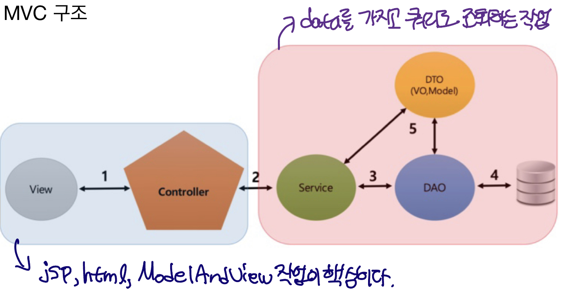

# 스프링 프레임워크 구동 원리

### Framework&#x20;

프로그래밍에서 특정 운영 체제를 위한 응용 프로그램 표준 구조를 구현하는 클래스와 라이브러리의 모임&#x20;

### Spring Framework&#x20;

자바 플랫폼을위한 오픈소스 애플리케이션 프레임워크

* 스프링은 POJO(Plain Old Java Object)방식의 프레임워크이다.(기존의 라이브러리등을 지원하기에 용이하고 객체가 가볍다.)&#x20;
* 스프링은 제어반전(IOC: Inversion Of Control)을 지원한다.(컨트롤의 제어권이 사용자가 아니라 프레임워크에 있어서 필요에 따라 스프링에서 사용자의 코드를 호출한다.)&#x20;
* 스프링은 의존성 주입(DI : Dependency Injection)을 지원한다.(각각의 계층이나 서비스들 간에 의존성이 존재할 경우프레임워크가 연결시킨다)&#x20;
* 스프링은 관점 지향 프로그래밍(AOP : Aspect-Oriented Programming)을 지원한다. 따라서 트랜잭션이나 로깅, 보안과 같이 여러 모듈에서 공통적으로 사용하는기능을 분리하여 관리할 수 있다.
* &#x20;스프링은 영속성과 관련된 다양한 서비스를 지원한다.(iBatis, Hibernate등 완성도가 높은 데이터베이스 처리 라이브러리와 연결할 수 있는 인터페이스 제공)&#x20;
* 스프링은 확장성이 높다.

### MVC 구조

<figure><figcaption></figcaption></figure>

