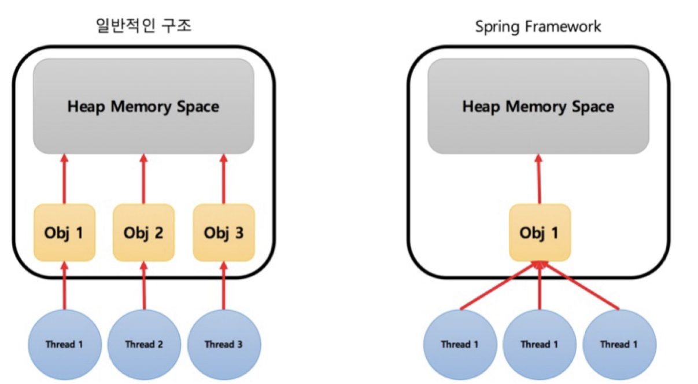
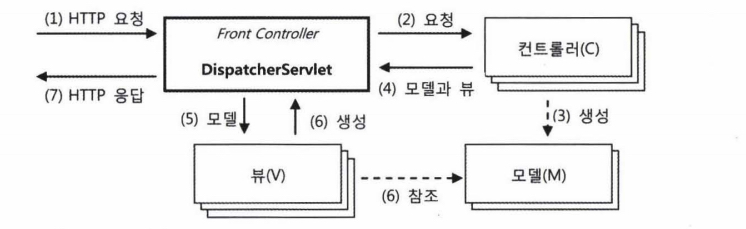

# 스프링 프레임워크 구동 원리

### Framework&#x20;

프로그래밍에서 특정 운영 체제를 위한 응용 프로그램 표준 구조를 구현하는 클래스와 라이브러리의 모임&#x20;

### Spring Framework&#x20;

자바 플랫폼을위한 오픈소스 애플리케이션 프레임워크

* 스프링은 POJO(Plain Old Java Object)방식의 프레임워크이다.(기존의 라이브러리등을 지원하기에 용이하고 객체가 가볍다.)&#x20;
* 스프링은 제어반전(IOC: Inversion Of Control)을 지원한다.(컨트롤의 제어권이 사용자가 아니라 프레임워크에 있어서 필요에 따라 스프링에서 사용자의 코드를 호출한다.)&#x20;
* 스프링은 의존성 주입(DI : Dependency Injection)을 지원한다.(각각의 계층이나 서비스들 간에 의존성이 존재할 경우프레임워크가 연결시킨다)&#x20;
* 스프링은 관점 지향 프로그래밍(AOP : Aspect-Oriented Programming)을 지원한다. 따라서 트랜잭션이나 로깅, 보안과 같이 여러 모듈에서 공통적으로 사용하는기능을 분리하여 관리할 수 있다.
* &#x20;스프링은 영속성과 관련된 다양한 서비스를 지원한다.(iBatis, Hibernate등 완성도가 높은 데이터베이스 처리 라이브러리와 연결할 수 있는 인터페이스 제공)&#x20;
* 스프링은 확장성이 높다.

### MVC 구조

<figure><figcaption></figcaption></figure>

Model-View-Controller

(1) : VIew와 Controller와의 관계이다. 뷰는 사용자가 실제 보여지는 화면을 의미한다. 즉 화면에서 어떤 특정 서비스를 제공받기 위해 버튼을 클릭 시 이를 컨트롤러가 이벤트를 인식하게 된다. 컨트롤러는 이후 과정에서 발생되는 데이터에 따라 적절하게 다시 사용자에게 결과화면을 제공한다. 만약 에러나 다른 서비스를 보여 줄 시 뷰를 다르게 할 수 있다. View 영역은 html, jsp등으로 구성한다.

(2) : Controller와 Service의 관계이다. Service는 실제 비즈니스 로직이 들어가는 부분이다. 컨트롤러는 뷰단에서 사용자에 이벤트를 적절한 서비스에게 전달한다. 이를 받은 서비스는 비즈니스 로직을 처리하게 된다.

(3) : Service와 DAO의 관계이다. 실제 데이터베이스 작업을 통해 데이터를 로드하는 과정이다. 비즈니스 로직에서 필요한 데이터를 실제 Connection을 담당하고 있는 DAO를 이용해서 가져온다.

(4) : DAO와 DB와의 관계이다. JDBC로직을 이용해서 DB(원격 포함)에서 CRUD를 통해 데이터를 입력, 로드한다.

(5) : Service와 DAO가 작업을 수행하는데 있어서 데이터 포맷을 제공해주는 역할을 한다. DTO라고 불리고 VO, Model이라고도 불린다. 경우에 따라서 클래스 생성 시 Beans라고도 한다. 스프링은 객체단위로 움직이기 때문에 DTO를 이용해서 데이터를 주고받는다.

이러한 MVC처리과정은 어노테이션(@)을 이용해서 체계적으로 관리(@Controller, @Service, @Repository 등)하게 된다. \*DAO : Data Access Object / DTO : Data Transfer Object (VO : Value Object)

### Spring Framework 구조

<figure><figcaption></figcaption></figure>

웹 서버 구조에서 Client당 Thread의 개념으로 접근 위 그림에서 세 명의 user가 동시에 서버에 접속할 때를 보여주고 있다. 일반적인 구조에서 각 스레드 당 객체 들이 생성된다. 스레드의 개수만큼 객체가 생성되게 되고 그 객체의 메모리가 서버의 힙 메모리 공간에 저장되게 된다.

반면 스프링이 권장하고 있는 사항은 일반적인 구조처럼 각 스레드당 new를 해서 객체를 만드는 것이 아닌 beans 파일 즉 xml에 한번만 정의 해놓고 각 스레드가 해당 자원을 공유하면서 결론적으론 서버의 힙공간에는 초기 셋팅 시 딱 하나만 생성되게 된다. 스프링 프레임워크는 기본적으로 이러한 구조, SingleTone패턴을 권장한다. 각 스레드 당 객체를 관리하는 것보다 객체를 하나만 보유하고 있으면서 그걸 공유하는 방법이 더 효율 적이다. 스프링에서 이런것을 지원하기 위해 @Autowired를 지원한다.

[https://rokroks.tistory.com/50](https://rokroks.tistory.com/50) JPA 동작원리

<figure><figcaption></figcaption></figure>

스프링의 웹 기술은 MVC 아키텍처를 근간으로 하고 있다. MVC는 프레젠테이션 계층의 구성요소를 정보를 담은 모델(M), 화면 출력 로직을 담은 뷰(V), 그리고 제어 로직을 담은 컨트롤러(C)로 분리하고 이 세 가지 요소가 서로 협력해서 하나의 웹 요청을 처리하고 응답을 만들어내는 구조다.

MVC 아키텍처는 보통 프론트 컨트롤러패턴과 함께 사용된다. 프론트 컨트롤러 패턴은 프레젠테이션 계층 제일앞에서 서버로 들어오는 모든 요청을 먼저 받아서 처리하게 만든다.

스프링이 제공하는 스프링 서블릿/MVC의 핵심은 DispatcherServlet이라는 프론트 컨트롤러다.

1. DispatcherServlet의 HTTP요청 접수 자바 서버의 서블릿 컨테이너는 HTTP 요청정보를 DispatcherServlet에 전달해준다. web.xml에는 보통 DispatcherServlet이 전달받을 URL의 패턴이 정의되어 있다. DispatcherServlet은 모든 요청에 대해 공통적으로 진행해야 하는 전처리 작업이 등록된 것을 먼저 수행한다. 공통적으로 이용 가능한 보안이나 파라미터 조작, 한글 디코딩 같은 작업을 적용된다.
2. DispatcherServlet에서 컨트롤러로 HTTP요청 위임 DispatcherServlet은 URL이나 파라미터 정보, HTTP 명령 등을 참고로 해서 어떤 컨트롤러에게 작업을위임할지 결정한다.
